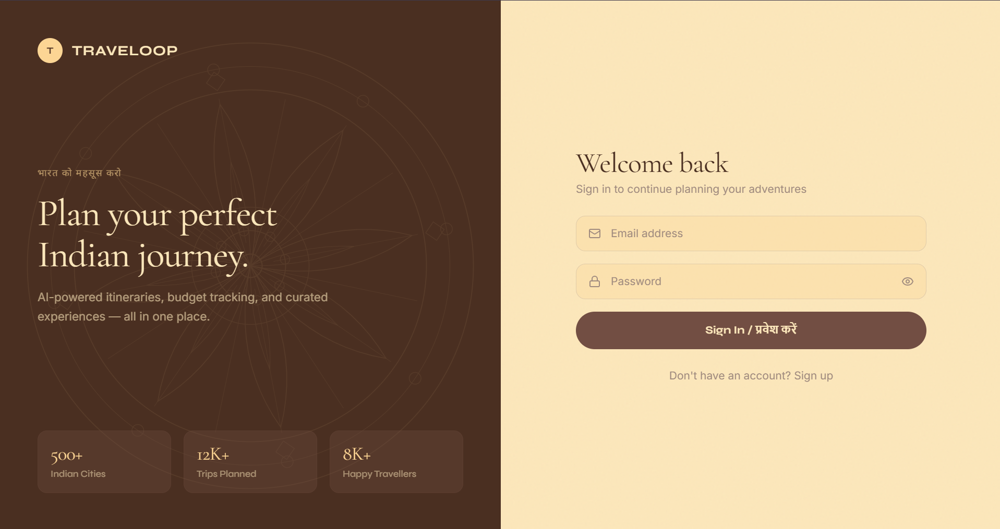
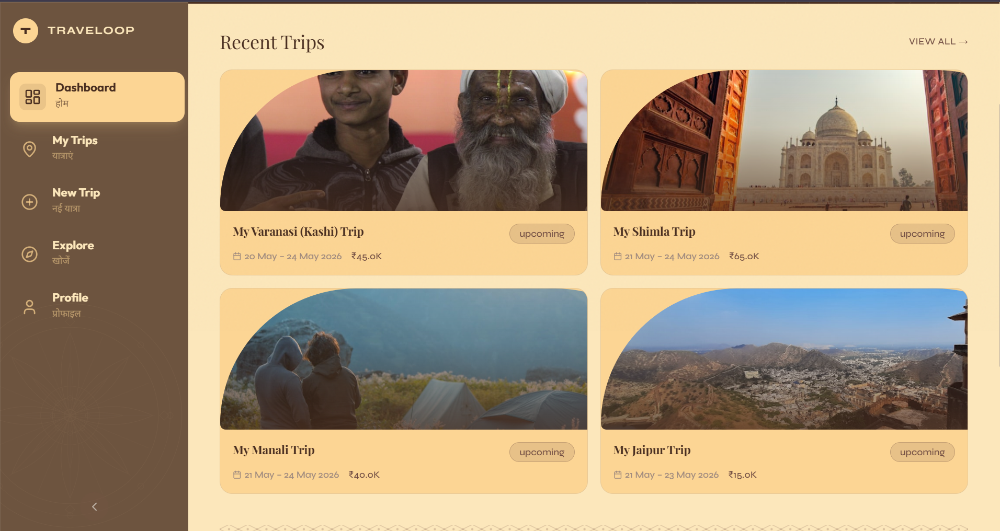
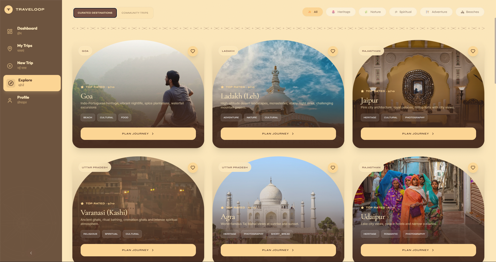
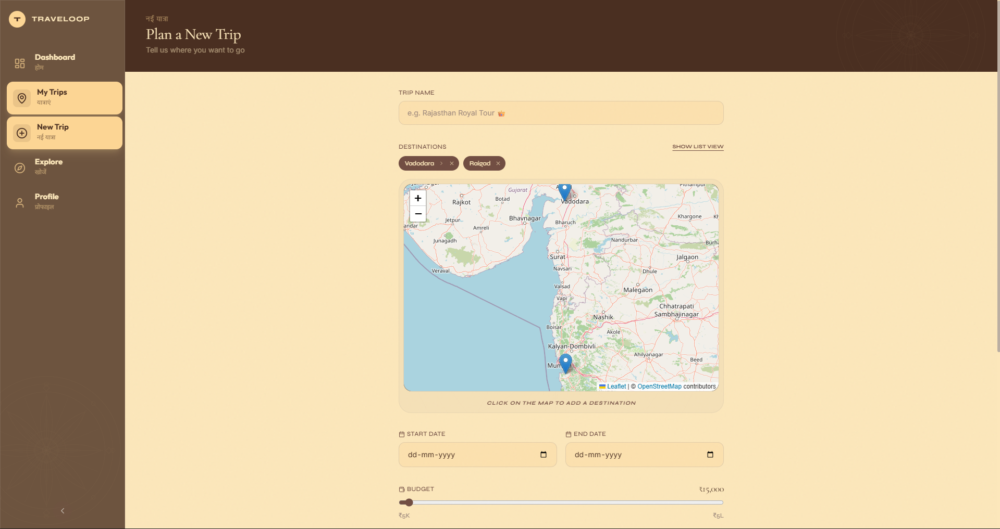

# 🧭 TRAVELOOP — Premium AI-Powered Indian Travel Planner

**TRAVELOOP** is a state-of-the-art travel planning application designed to simplify and elevate the experience of exploring India. Built for a hackathon, it combines a sophisticated "Glassmorphism" UI with advanced AI to generate personalized itineraries, manage trips, and discover the hidden gems of the Indian subcontinent.

---

## ✨ Project Previews

  
  

  
  

---

## 🌟 Key Features

- **🤖 AI Trip Architect**: Personalized daily itineraries generated by Gemini Pro based on your preferences and location.
- **🗺️ Interactive Exploration**: Discover 500+ Indian destinations with a visual map-based interface and category filtering.
- **💰 Smart Budgeting**: Keep track of your travel expenses with categorized spending and real-time budget updates.
- **🎨 Premium Aesthetic**: A unique "Sand & Sun" Glassmorphism UI that blends modern tech with traditional Indian motifs.
- **📸 Visual Journey**: Integrated Unsplash API to provide stunning photography for every city you visit.

---

## 🏗️ The Development Journey: How it was built

The creation of **Travelloop** followed a structured, professional workflow:
1.  **Conceptualization**: Identifying the gap in the market for a travel planner that understands the cultural and geographical nuances of India.
2.  **UI/UX Design**: Crafting a unique design language using Vanilla CSS variables and Tailwind, focusing on a "Glassmorphism" aesthetic that feels modern yet grounded.
3.  **Backend Architecture**: Setting up a robust PostgreSQL database on Supabase with Row-Level Security (RLS) to ensure user data privacy from day one.
4.  **AI Integration**: Prompt engineering with Google's Gemini Pro to ensure the generated itineraries are logical, time-efficient, and culturally aware.
5.  **Data Ingestion**: Cleaning and structured ingestion of a massive Kaggle dataset to provide a pre-seeded database of 500+ Indian destinations.

---

## 🛠️ Technology Stack

### **Core Languages & Frameworks**
- **Next.js 14 (App Router)**: The backbone of the application, providing lightning-fast server-side rendering and SEO optimization.
- **TypeScript**: Used throughout the project to ensure type safety and minimize runtime errors.
- **Tailwind CSS**: For high-performance, utility-first styling.

### **Backend & Infrastructure**
- **Supabase**: Our unified backend-as-a-service.
  - **PostgreSQL**: Stores user profiles, trip details, and destination metadata.
  - **Supabase Auth**: Handles secure user authentication and session persistence.
  - **Storage**: Manages user profile photos and assets.

---

## 🔑 API Keys & Their Functions

To run Travelloop, the following API keys are essential:

| API Key | Source | Function in Travelloop |
| :--- | :--- | :--- |
| `GEMINI_API_KEY` | Google AI Studio | Powers the "AI Trip Planner" to generate custom daily itineraries. |
| `SUPABASE_URL` | Supabase | The endpoint for our database and authentication services. |
| `SUPABASE_ANON_KEY` | Supabase | Allows the frontend to securely interact with the database under RLS. |
| `UNSPLASH_ACCESS_KEY` | Unsplash | Dynamically fetches high-resolution photos of Indian cities and landmarks. |
| `GEODB_API_KEY` | GeoDB Cities | Provides metadata like population, elevation, and coordinates for 500,000+ cities. |

---

## 📊 Data Source: Kaggle Indian Tourism Dataset

We leveraged a specialized **Indian Tourism dataset from Kaggle** to provide an authentic experience.
- **Content**: 500+ curated destinations across all 28 states and 8 Union Territories.
- **Integration**: The data was pre-processed and uploaded to our Supabase database to allow for instant searching and filtering by category (e.g., "Spiritual", "Heritage", "Nature").
- **Usage**: Used to populate the "Explore" page and provide suggestions during the trip planning phase.

---

## 🚀 Getting Started

1.  **Clone the Repo**: `git clone https://github.com/your-username/travelloop.git`
2.  **Install Dependencies**: `npm install`
3.  **Setup Environment**: Create a `.env.local` file with the keys mentioned above.
4.  **Run Locally**: `npm run dev`

---

## 📺 Interactive Video Explanation
For a full walkthrough of the features and technical implementation, watch our video:
[**Travelloop - Hackathon Submission Demo**](https://youtu.be/iBX1ICdOFOk?si=fuQ9tXF_Lm_Igd5H)

---

*Built with passion for the OdooxParul Hackathon 2026.*
